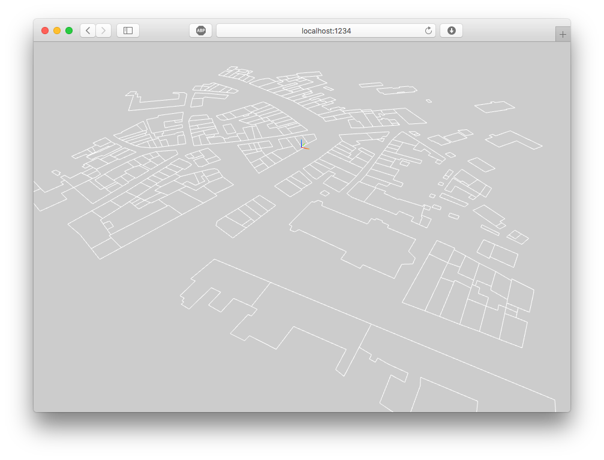
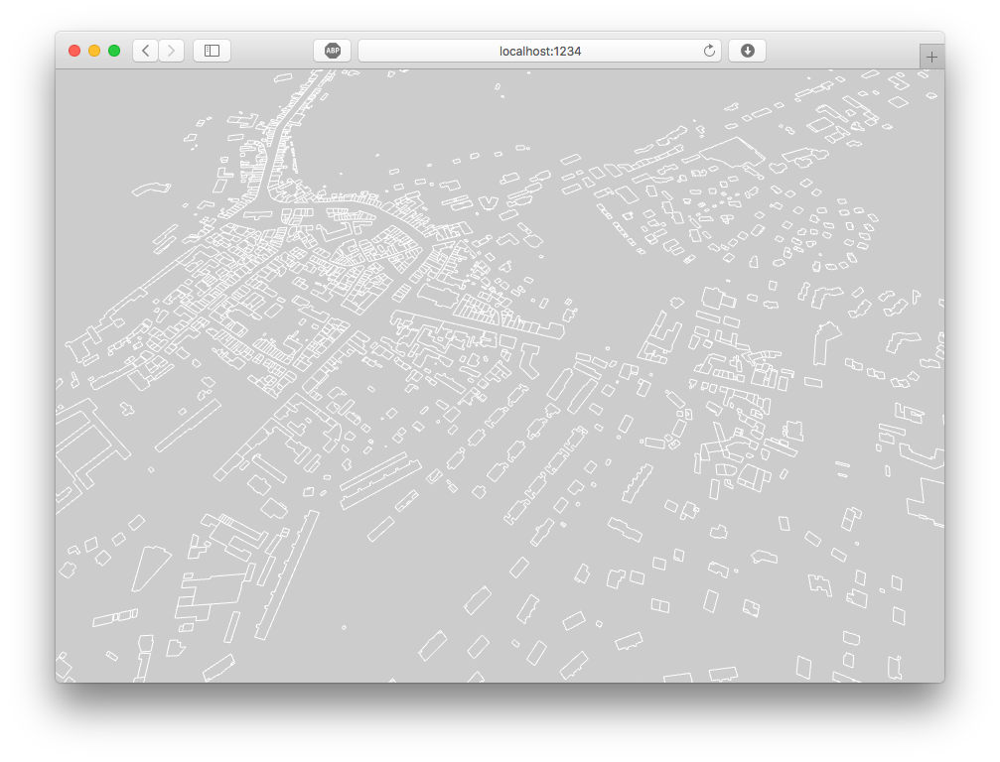

# three-osm-loader
Import Open Street Map

- [ ] Import roads and streets as `THREE.Line` instances
- [ ] Import roads and streets as generic `THREE.Geometry` instances
- [x] Import building footprints as `THREE.Line` instances
- [ ] Import building footprints as generic `THREE.Geometry` instances

## Demo

Live Demo (Coming soon!) or `npm run demo`

## Examples

